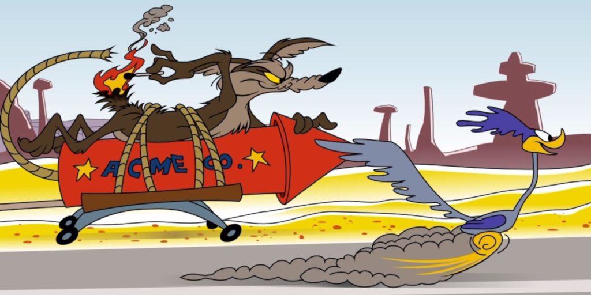

# Roadrunner

It doesn’t matter how hard IT department work in order to avoid attacks, pirates will always be at least one step ahead. Intel's McAfee Security and The Center for Strategic and International Studies (CSIS) released a report in 2017: [Tilting the Playing Field: How Misaligned Incentives Work Against Cybersecurity (PDF)](https://www.csis.org/events/tilting-playing-field-how-misaligned-incentives-work-against-cybersecurity). After surveying 800 cybersecurity professionals, the authors concluded there is a major misalignment of incentives that give cybercriminals a huge advantage. Some examples are:

* Structured corporate bureaucracies are unable to react fast enough to keep up with free-wheeling criminal enterprises.
* A disconnect exists between strategy and implementation of cybersecurity programs.
* Different incentives for senior executives and those managing cybersecurity programs.

Everything comes down to Coyote trying to catch the Roadrunner. Our 2 cents on that:

* With linear thinking we think through ideas with the efficiency of a well-oiled machine. We enjoy structured thought and evidence-based conclusions. We plan out every step of a process, follow the process to the “t”, and ensure results within schedules and deadlines. Following the [phases of pentesting](Phases-of-penetration-testing.md) one takes us on the already known paths.
* With non-linear thinking we enjoy the big ideas, new discoveries, and receive satisfaction from creation. We are always coming up with new ways to solve problems, love the “what if?” questions and don’t mind jumping around in complex related thought patterns (while not believing them to be written in stone and more like weather patterns). And the imaginative approach is risky. Excellent paranoia for the job requires not landing ourselves in protectionist mindsets. The best hackers use a lot of non-linear thinking to discover new possible hacks, and this is the main reason why Coyote never catches the Roadrunner. 

We are not arguing that one is more important or practical than the other (it all depends on [type](Types-of-pentesting.md) and [purpose](Purpose-of-pentesting.md) of the effort). Rather we suggest that both linear and non-linear thought are integral to success in pentesting (and, on a grander scale, in life). We can set up for the basic 5 phases of pentesting and follow through on those, **and** we also need space and time to be able to jump around a bit to perhaps find some more elephants in the room that could otherwise be overlooked. Excellence in pentesting requires balancing between the two. When doing security audits for compliance with the known, we need more linear thought, when doing red teaming, non-linear thinking and discovering new moves to make becomes key.

As metaphors we use "spontaneous choreography" for the exploitation process and "puzzles" for targets to stimulate the right brain and be guide for some of the best puzzling (threat modelling and hacking). Attack trees then represent movements and puzzle pieces that may or may not be needed in a particular context for a particular purpose. Oh, and in all  cases we have humour. Lots of it.

 
