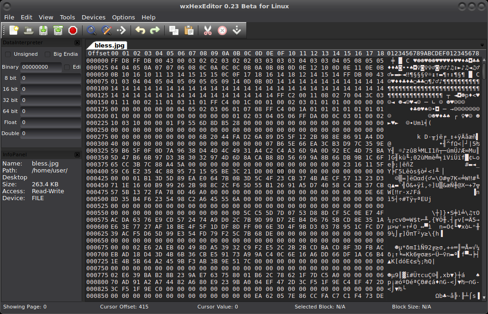

# Removing metadata with hex editors

The hexadecimal notation is almost universally used in computing - and not without a reason. There are sixteen hex digits - 0 to 9, and A to F (which correspond to decimal values 10 to 15), and each hex digit represents exactly four bits. Exactly two hex digits represent a byte, which can have a value from 00 to FF.

A hex byte is the only kind of object a computer handles, and hex bytes are used to represent anything. For example, a hex byte 50 may represent the capital letter P, the processor command push eax, the decimal number 80, a colour component with 50% brightness, or whatever else lives in the digital world.

And that means we have editors, hex editors, that can be used to view and change files, all files, on a very low level. As in, they can be used to remove metadata from any and all files. 

## Usage in general

* backup the file before using a hex editor on it.
* switch to ASCII mode, turn off “read only” mode, and start searching through the file.

For example, when scrubbing pdf’s from creation and modification information look through the entire file for “created” (metadata appears in the PDF file more than once). If and when you find metadata, change to fake data or delete. Then repeat your search again for the terms “create”, “creation”, “modified”, and “modify”, and similarly either replace or delete the dates, once again being sure to repeat each search so that any potential multiple instances of the field can be located and modified or blanked out. 

## Windows

Windows do not have any pre-installed hex editor in their operating systems. Hex files can be stored in the text format or binary format. If you have a text-based hex file, then it can be opened with text editors like notepad. If you have a binary hex file, then the only option to open them is by using the third-party hex editing programs. 

* [HxD](https://mh-nexus.de/en/hxd/) Freeware Hex Editor and Disk Editor
* [Free Hex Editor Neo](https://www.hhdsoftware.com/free-hex-editor)

### File properties

On windows, open file Properties in Windows Explorer for each file. In the Details tab, click "Remove Properties and Personal information". Choose to "Remove the following properties from this file", select which metadata to remove, and press OK. There may still be other data though.

## Mac

* [iBored](https://apps.tempel.org/iBored/) - Also windows and linux

## Online

* [Hexed.it](https://hexed.it/) HTML5/JS => will be cached on local machine and can then be used

## Linux

* [bless](https://github.com/bwrsandman/Bless) is a binary (hex) editor for the GNOME Desktop. 
* [wxhexeditor](http://www.wxhexeditor.org/) is a hexadecimal file editor suitable for editing very big files. Supported file size is up to 2**64 bytes. 
* [dhex](http://manpages.ubuntu.com/manpages/precise/man1/dhex.1.html) provides a console based hex edit screen with menus like Goto, Search, and HexCal

### Using vi as hex editor

It is also possible to use <code>vi</code> as a hex editor. It isn’t a real “hex mode”, what happens is that vi’s buffer is streamed through the external program xxd, but it works well for some cases of scrubbing.

Open a file in vi as usual, hit escape and to switch into hex mode type:

    :%!xxd

And when done, to exit from hex mode, hit escape again and type:

    :%!xxd -r

