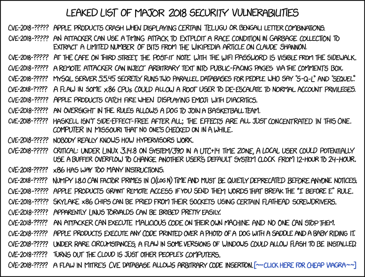

# Vulnerabilities

Flaws that make software act in ways that designers and developers did not intend it to, or even expect. Most listed here are known vulnerabilities, ongoing with long standing histories, and useful for pentesting purposes.

## Security note

CVE seems to fall behind in coverage, apparently failing to report 29% of known vulnerabilities in 2020. Don't rely on single sources (many efforts at disclosure and research are ongoing) and on thinking on one's own two feet.

* [Vulnerability Notes Database SEI](https://www.kb.cert.org/vuls/)
* [Mitre CVE](http://cve.mitre.org/cve/search_cve_list.html)

## Problems or Suggestions

[Open an issue here](https://github.com/tymyrddin/orchard/issues)

## Contributing

This project welcomes contributions and suggestions. 

